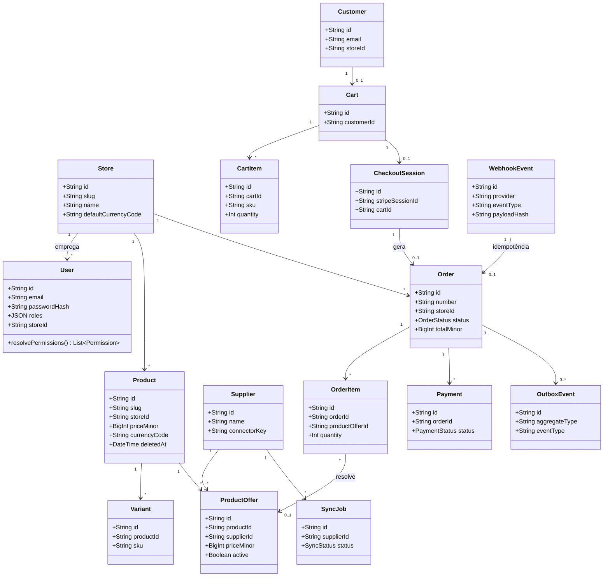
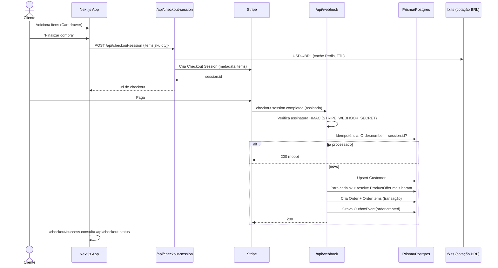
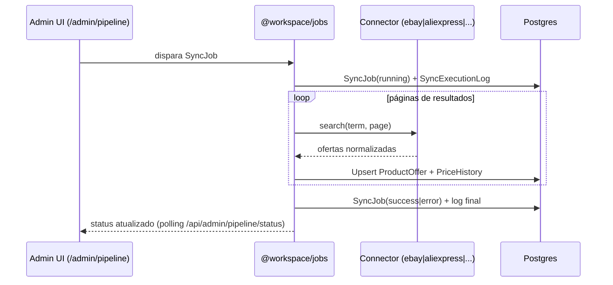
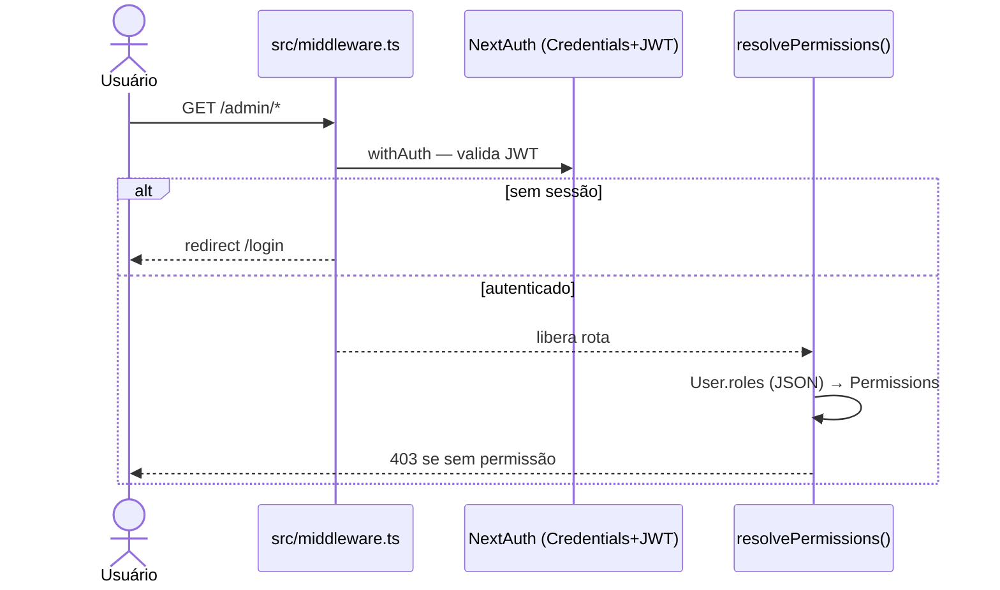

# UML — Diagrama de Classes e Sequência

Fonte de verdade: `prisma/schema.prisma` (36 modelos). Diagramas em Mermaid.

## 1. Diagrama de classes — Núcleo de domínio

## 2. Sequência — Checkout + Webhook Stripe (caminho crítico)

## 3. Sequência — Pipeline de sincronização de fornecedor

## 4. Sequência — Autenticação e autorização

