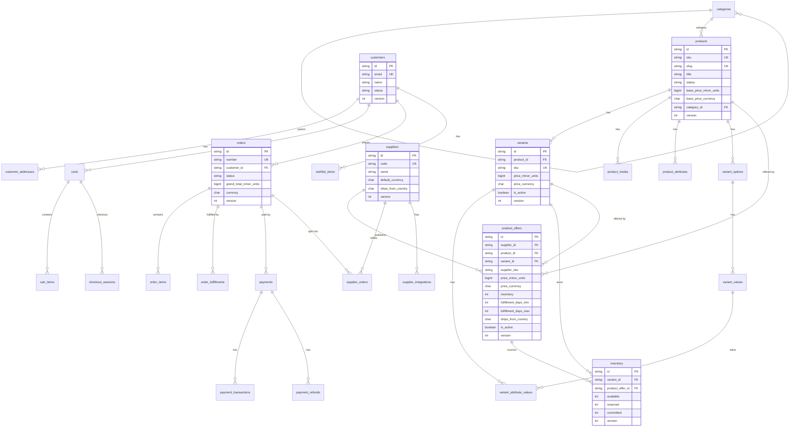

# Persistence Model

> The complete relational model for the Dropshipping Platform.
> This document defines **what** is persisted — Prisma schema (04B) is a
> mechanical translation of this model.
>
> See `adr/0009-persistence-model.md` for the **why** behind each convention.

## 1. Conventions

### 1.1 Naming

| Element       | Convention            | Example                   |
| ------------- | --------------------- | ------------------------- |
| Table         | `snake_case`, plural  | `products`, `order_items` |
| Column        | `snake_case`          | `created_at`, `sku`       |
| Primary key   | `id` (cuid)           | `cuid_xxx`                |
| Foreign key   | `<table_singular>_id` | `product_id`, `order_id`  |
| Join table    | `<a>_<b>` (alpha)     | `product_categories`      |
| Index         | `idx_<table>_<cols>`  | `idx_products_slug`       |
| Unique index  | `uq_<table>_<cols>`   | `uq_products_sku`         |
| FK constraint | `fk_<table>_<col>`    | `fk_order_items_order_id` |

### 1.2 Audit Fields (every table)

```sql
created_at   TIMESTAMPTZ NOT NULL DEFAULT NOW()
updated_at   TIMESTAMPTZ NOT NULL DEFAULT NOW()
deleted_at   TIMESTAMPTZ NULL                    -- soft delete
created_by   VARCHAR(30) NULL                    -- "system" | "seed" | user id
updated_by   VARCHAR(30) NULL
```

- Queries default to `WHERE deleted_at IS NULL`.
- Hard delete forbidden in app code; only via admin script.

### 1.3 Optimistic Lock (versioned aggregates)

```sql
version INTEGER NOT NULL DEFAULT 1
```

On update: `UPDATE ... SET version = version + 1 WHERE id = ? AND version = ?`.
0 rows affected → `OptimisticLockError`.

Applied to: `products`, `categories`, `variants`, `customers`, `carts`,
`checkout_sessions`, `orders`, `payments`, `suppliers`, `supplier_orders`,
`product_offers`, `inventory`.

### 1.4 Money (never DECIMAL)

```sql
amount_in_minor_units BIGINT NOT NULL    -- cents (1999 = $19.99)
currency              CHAR(3) NOT NULL   -- ISO 4217 ("USD")
```

BIGINT (not INT) because some currencies have 0 decimals (JPY) and large
amounts can overflow INT.

### 1.5 IDs

- All primary keys are **cuid** (string, collision-resistant, sortable).
- Branded at the domain layer (`ProductId`, `OrderId`, ...) — see ADR-0005.
- Stored as `VARCHAR(30)` in the database.

### 1.6 Timestamps

- All timestamps are `TIMESTAMPTZ` (with time zone).
- Stored in UTC; converted to user locale at the presentation layer.

---

## 2. Entity Relationship Diagram



---

## 3. Table Catalog

### 3.1 Catalog Context

#### `categories`

| Column         | Type           | Constraints            |
| -------------- | -------------- | ---------------------- |
| id             | VARCHAR(30) PK | cuid                   |
| slug           | VARCHAR(120)   | UNIQUE, NOT NULL       |
| name           | VARCHAR(200)   | NOT NULL               |
| parent_id      | VARCHAR(30) FK | NULL (root categories) |
| description    | TEXT           | NULL                   |
| version        | INTEGER        | NOT NULL DEFAULT 1     |
| + audit fields |                |                        |

Indexes: `uq_categories_slug`, `idx_categories_parent_id`.

#### `products`

| Column                 | Type           | Constraints                                 |
| ---------------------- | -------------- | ------------------------------------------- |
| id                     | VARCHAR(30) PK | cuid                                        |
| sku                    | VARCHAR(32)    | UNIQUE, NOT NULL                            |
| slug                   | VARCHAR(120)   | UNIQUE, NOT NULL                            |
| title                  | VARCHAR(300)   | NOT NULL                                    |
| description            | TEXT           | NOT NULL DEFAULT ''                         |
| status                 | VARCHAR(20)    | NOT NULL ('draft', 'published', 'archived') |
| base_price_minor_units | BIGINT         | NOT NULL                                    |
| base_price_currency    | CHAR(3)        | NOT NULL                                    |
| category_id            | VARCHAR(30) FK | NULL                                        |
| version                | INTEGER        | NOT NULL DEFAULT 1                          |
| + audit fields         |                |                                             |

Indexes: `uq_products_sku`, `uq_products_slug`, `idx_products_category_id`, `idx_products_status`, `idx_products_created_at`.

#### `variants`

| Column                       | Type           | Constraints           |
| ---------------------------- | -------------- | --------------------- |
| id                           | VARCHAR(30) PK | cuid                  |
| product_id                   | VARCHAR(30) FK | NOT NULL              |
| sku                          | VARCHAR(32)    | UNIQUE, NOT NULL      |
| price_minor_units            | BIGINT         | NOT NULL              |
| price_currency               | CHAR(3)        | NOT NULL              |
| compare_at_price_minor_units | BIGINT         | NULL                  |
| compare_at_price_currency    | CHAR(3)        | NULL                  |
| is_active                    | BOOLEAN        | NOT NULL DEFAULT TRUE |
| version                      | INTEGER        | NOT NULL DEFAULT 1    |
| + audit fields               |                |                       |

Indexes: `uq_variants_sku`, `idx_variants_product_id`.

#### `variant_options` (per Rec 8)

| Column         | Type           | Constraints                |
| -------------- | -------------- | -------------------------- |
| id             | VARCHAR(30) PK | cuid                       |
| product_id     | VARCHAR(30) FK | NOT NULL                   |
| name           | VARCHAR(100)   | NOT NULL ('Color', 'Size') |
| position       | INTEGER        | NOT NULL DEFAULT 0         |
| + audit fields |                |                            |

Indexes: `idx_variant_options_product_id`, `uq_variant_options_product_name`.

#### `variant_values`

| Column         | Type           | Constraints            |
| -------------- | -------------- | ---------------------- |
| id             | VARCHAR(30) PK | cuid                   |
| option_id      | VARCHAR(30) FK | NOT NULL               |
| value          | VARCHAR(200)   | NOT NULL ('Red', 'XL') |
| position       | INTEGER        | NOT NULL DEFAULT 0     |
| + audit fields |                |                        |

Indexes: `idx_variant_values_option_id`.

#### `variant_attribute_values` (join: variant ↔ value)

| Column     | Type                   | Constraints |
| ---------- | ---------------------- | ----------- |
| variant_id | VARCHAR(30) FK         | NOT NULL    |
| value_id   | VARCHAR(30) FK         | NOT NULL    |
| PK         | (variant_id, value_id) | composite   |

#### `product_media` (per Rec 7)

| Column         | Type           | Constraints            |
| -------------- | -------------- | ---------------------- |
| id             | VARCHAR(30) PK | cuid                   |
| product_id     | VARCHAR(30) FK | NOT NULL               |
| url            | TEXT           | NOT NULL               |
| alt_text       | VARCHAR(500)   | NOT NULL DEFAULT ''    |
| position       | INTEGER        | NOT NULL DEFAULT 0     |
| is_primary     | BOOLEAN        | NOT NULL DEFAULT FALSE |
| + audit fields |                |                        |

Indexes: `idx_product_media_product_id`, `idx_product_media_is_primary`.

#### `product_attributes`

| Column         | Type           | Constraints |
| -------------- | -------------- | ----------- |
| id             | VARCHAR(30) PK | cuid        |
| product_id     | VARCHAR(30) FK | NOT NULL    |
| name           | VARCHAR(100)   | NOT NULL    |
| value          | VARCHAR(500)   | NOT NULL    |
| + audit fields |                |             |

Indexes: `idx_product_attributes_product_id`.

#### `inventory` (per Rec 9)

| Column           | Type           | Constraints              |
| ---------------- | -------------- | ------------------------ |
| id               | VARCHAR(30) PK | cuid                     |
| variant_id       | VARCHAR(30) FK | NOT NULL                 |
| product_offer_id | VARCHAR(30) FK | NULL (NULL = aggregated) |
| available        | INTEGER        | NOT NULL DEFAULT 0       |
| reserved         | INTEGER        | NOT NULL DEFAULT 0       |
| committed        | INTEGER        | NOT NULL DEFAULT 0       |
| reordered_at     | TIMESTAMPTZ    | NULL                     |
| version          | INTEGER        | NOT NULL DEFAULT 1       |
| + audit fields   |                |                          |

Indexes: `idx_inventory_variant_id`, `uq_inventory_variant_offer`.

### 3.2 Customer Context

#### `customers`

| Column         | Type           | Constraints               |
| -------------- | -------------- | ------------------------- |
| id             | VARCHAR(30) PK | cuid                      |
| email          | VARCHAR(254)   | UNIQUE, NOT NULL          |
| name           | VARCHAR(200)   | NOT NULL                  |
| locale         | VARCHAR(10)    | NOT NULL DEFAULT 'en'     |
| status         | VARCHAR(20)    | NOT NULL DEFAULT 'active' |
| last_login_at  | TIMESTAMPTZ    | NULL                      |
| version        | INTEGER        | NOT NULL DEFAULT 1        |
| + audit fields |                |                           |

Indexes: `uq_customers_email`, `idx_customers_status`.

#### `customer_addresses`

| Column         | Type           | Constraints            |
| -------------- | -------------- | ---------------------- |
| id             | VARCHAR(30) PK | cuid                   |
| customer_id    | VARCHAR(30) FK | NOT NULL               |
| label          | VARCHAR(50)    | NOT NULL               |
| line1          | VARCHAR(200)   | NOT NULL               |
| line2          | VARCHAR(200)   | NULL                   |
| city           | VARCHAR(100)   | NOT NULL               |
| state          | VARCHAR(100)   | NULL                   |
| postal_code    | VARCHAR(20)    | NOT NULL               |
| country        | CHAR(2)        | NOT NULL               |
| is_default     | BOOLEAN        | NOT NULL DEFAULT FALSE |
| + audit fields |                |                        |

Indexes: `idx_customer_addresses_customer_id`.

#### `wishlist_items`

| Column         | Type           | Constraints |
| -------------- | -------------- | ----------- |
| id             | VARCHAR(30) PK | cuid        |
| customer_id    | VARCHAR(30) FK | NOT NULL    |
| product_id     | VARCHAR(30) FK | NOT NULL    |
| variant_id     | VARCHAR(30) FK | NULL        |
| + audit fields |                |             |

Indexes: `idx_wishlist_customer_id`, `uq_wishlist_customer_product_variant`.

### 3.3 Cart Context

#### `carts`

| Column         | Type           | Constraints               |
| -------------- | -------------- | ------------------------- |
| id             | VARCHAR(30) PK | cuid                      |
| customer_id    | VARCHAR(30) FK | NULL (anonymous carts)    |
| session_id     | VARCHAR(30)    | NOT NULL                  |
| currency       | CHAR(3)        | NOT NULL                  |
| status         | VARCHAR(20)    | NOT NULL DEFAULT 'active' |
| version        | INTEGER        | NOT NULL DEFAULT 1        |
| + audit fields |                |                           |

Indexes: `idx_carts_customer_id`, `idx_carts_session_id`, `idx_carts_status`.

#### `cart_items`

| Column                 | Type           | Constraints                   |
| ---------------------- | -------------- | ----------------------------- |
| id                     | VARCHAR(30) PK | cuid                          |
| cart_id                | VARCHAR(30) FK | NOT NULL                      |
| product_id             | VARCHAR(30) FK | NOT NULL                      |
| variant_id             | VARCHAR(30) FK | NULL                          |
| quantity               | INTEGER        | NOT NULL CHECK (quantity > 0) |
| unit_price_minor_units | BIGINT         | NOT NULL                      |
| unit_price_currency    | CHAR(3)        | NOT NULL                      |
| + audit fields         |                |                               |

Indexes: `idx_cart_items_cart_id`, `uq_cart_items_cart_product_variant`.

### 3.4 Checkout Context

#### `checkout_sessions`

| Column           | Type           | Constraints                  |
| ---------------- | -------------- | ---------------------------- |
| id               | VARCHAR(30) PK | cuid                         |
| cart_id          | VARCHAR(30) FK | NOT NULL                     |
| customer_id      | VARCHAR(30) FK | NULL                         |
| currency         | CHAR(3)        | NOT NULL                     |
| shipping_address | JSONB          | NULL                         |
| billing_address  | JSONB          | NULL                         |
| shipping_method  | JSONB          | NULL                         |
| status           | VARCHAR(20)    | NOT NULL DEFAULT 'initiated' |
| version          | INTEGER        | NOT NULL DEFAULT 1           |
| + audit fields   |                |                              |

Indexes: `idx_checkout_sessions_cart_id`, `idx_checkout_sessions_status`.

### 3.5 Order Context

#### `orders`

| Column                     | Type           | Constraints                          |
| -------------------------- | -------------- | ------------------------------------ |
| id                         | VARCHAR(30) PK | cuid                                 |
| number                     | VARCHAR(20)    | UNIQUE, NOT NULL ('ORD-2026-000123') |
| customer_id                | VARCHAR(30) FK | NOT NULL                             |
| currency                   | CHAR(3)        | NOT NULL                             |
| subtotal_minor_units       | BIGINT         | NOT NULL                             |
| shipping_total_minor_units | BIGINT         | NOT NULL                             |
| tax_total_minor_units      | BIGINT         | NOT NULL                             |
| discount_total_minor_units | BIGINT         | NOT NULL DEFAULT 0                   |
| grand_total_minor_units    | BIGINT         | NOT NULL                             |
| shipping_address           | JSONB          | NOT NULL                             |
| billing_address            | JSONB          | NOT NULL                             |
| status                     | VARCHAR(20)    | NOT NULL DEFAULT 'pending'           |
| placed_at                  | TIMESTAMPTZ    | NOT NULL                             |
| confirmed_at               | TIMESTAMPTZ    | NULL                                 |
| paid_at                    | TIMESTAMPTZ    | NULL                                 |
| shipped_at                 | TIMESTAMPTZ    | NULL                                 |
| delivered_at               | TIMESTAMPTZ    | NULL                                 |
| cancelled_at               | TIMESTAMPTZ    | NULL                                 |
| version                    | INTEGER        | NOT NULL DEFAULT 1                   |
| + audit fields             |                |                                      |

Indexes: `uq_orders_number`, `idx_orders_customer_id`, `idx_orders_status`, `idx_orders_placed_at`.

#### `order_items`

| Column                 | Type           | Constraints         |
| ---------------------- | -------------- | ------------------- |
| id                     | VARCHAR(30) PK | cuid                |
| order_id               | VARCHAR(30) FK | NOT NULL            |
| product_id             | VARCHAR(30) FK | NOT NULL            |
| variant_id             | VARCHAR(30) FK | NULL                |
| sku                    | VARCHAR(32)    | NOT NULL (snapshot) |
| title                  | VARCHAR(300)   | NOT NULL (snapshot) |
| quantity               | INTEGER        | NOT NULL            |
| unit_price_minor_units | BIGINT         | NOT NULL (snapshot) |
| unit_price_currency    | CHAR(3)        | NOT NULL            |
| line_total_minor_units | BIGINT         | NOT NULL            |
| + audit fields         |                |                     |

Indexes: `idx_order_items_order_id`.

#### `order_fulfillments`

| Column          | Type           | Constraints                |
| --------------- | -------------- | -------------------------- |
| id              | VARCHAR(30) PK | cuid                       |
| order_id        | VARCHAR(30) FK | NOT NULL                   |
| supplier_id     | VARCHAR(30) FK | NOT NULL                   |
| status          | VARCHAR(20)    | NOT NULL DEFAULT 'pending' |
| tracking_number | VARCHAR(100)   | NULL                       |
| tracking_url    | TEXT           | NULL                       |
| shipped_at      | TIMESTAMPTZ    | NULL                       |
| delivered_at    | TIMESTAMPTZ    | NULL                       |
| + audit fields  |                |                            |

Indexes: `idx_order_fulfillments_order_id`, `idx_order_fulfillments_supplier_id`.

### 3.6 Payment Context

#### `payments`

| Column             | Type           | Constraints                           |
| ------------------ | -------------- | ------------------------------------- |
| id                 | VARCHAR(30) PK | cuid                                  |
| order_id           | VARCHAR(30) FK | NOT NULL                              |
| currency           | CHAR(3)        | NOT NULL                              |
| amount_minor_units | BIGINT         | NOT NULL                              |
| method_type        | VARCHAR(20)    | NOT NULL ('card', 'paypal', 'wallet') |
| method_last4       | VARCHAR(4)     | NULL                                  |
| method_brand       | VARCHAR(50)    | NULL                                  |
| status             | VARCHAR(20)    | NOT NULL DEFAULT 'initiated'          |
| initiated_at       | TIMESTAMPTZ    | NOT NULL                              |
| authorized_at      | TIMESTAMPTZ    | NULL                                  |
| captured_at        | TIMESTAMPTZ    | NULL                                  |
| version            | INTEGER        | NOT NULL DEFAULT 1                    |
| + audit fields     |                |                                       |

Indexes: `idx_payments_order_id`, `idx_payments_status`.

#### `payment_transactions`

| Column             | Type           | Constraints                                   |
| ------------------ | -------------- | --------------------------------------------- |
| id                 | VARCHAR(30) PK | cuid                                          |
| payment_id         | VARCHAR(30) FK | NOT NULL                                      |
| provider           | VARCHAR(20)    | NOT NULL ('stripe', 'paypal')                 |
| provider_tx_id     | VARCHAR(200)   | NOT NULL                                      |
| type               | VARCHAR(20)    | NOT NULL ('authorization', 'capture', 'void') |
| amount_minor_units | BIGINT         | NOT NULL                                      |
| amount_currency    | CHAR(3)        | NOT NULL                                      |
| status             | VARCHAR(20)    | NOT NULL                                      |
| failure_code       | VARCHAR(50)    | NULL                                          |
| failure_message    | TEXT           | NULL                                          |
| + audit fields     |                |                                               |

Indexes: `idx_payment_transactions_payment_id`, `uq_payment_transactions_provider_tx`.

#### `payment_refunds`

| Column             | Type           | Constraints |
| ------------------ | -------------- | ----------- |
| id                 | VARCHAR(30) PK | cuid        |
| payment_id         | VARCHAR(30) FK | NOT NULL    |
| provider_refund_id | VARCHAR(200)   | NOT NULL    |
| amount_minor_units | BIGINT         | NOT NULL    |
| amount_currency    | CHAR(3)        | NOT NULL    |
| reason             | TEXT           | NULL        |
| status             | VARCHAR(20)    | NOT NULL    |
| + audit fields     |                |             |

Indexes: `idx_payment_refunds_payment_id`.

### 3.7 Supplier Context

#### `product_offer_price_history` (per Ajuste 3)

Append-only table tracking every price change for a ProductOffer.

| Column                       | Type           | Constraints                                    |
| ---------------------------- | -------------- | ---------------------------------------------- |
| id                           | VARCHAR(30) PK | cuid                                           |
| offer_id                     | VARCHAR(30) FK | NOT NULL                                       |
| price_minor_units            | BIGINT         | NOT NULL (snapshot)                            |
| price_currency               | CHAR(3)        | NOT NULL                                       |
| compare_at_price_minor_units | BIGINT         | NULL                                           |
| compare_at_price_currency    | CHAR(3)        | NULL                                           |
| inventory                    | INTEGER        | NOT NULL (snapshot)                            |
| changed_at                   | TIMESTAMPTZ    | NOT NULL                                       |
| change_source                | VARCHAR(20)    | NOT NULL ('sync', 'manual', 'webhook')         |
| previous_price_minor_units   | BIGINT         | NULL                                           |
| previous_price_currency      | CHAR(3)        | NULL                                           |
| + audit fields               |                | (created_at only — append-only, never updated) |

Indexes: `idx_price_history_offer_id`, `idx_price_history_changed_at`.

**Note**: This table is append-only. Rows are never UPDATEd or DELETEd. This
enables time-series analysis of supplier pricing.

#### `suppliers`

| Column             | Type           | Constraints                                |
| ------------------ | -------------- | ------------------------------------------ |
| id                 | VARCHAR(30) PK | cuid                                       |
| code               | VARCHAR(20)    | UNIQUE, NOT NULL ('aliexpress', 'cj', ...) |
| name               | VARCHAR(200)   | NOT NULL                                   |
| default_currency   | CHAR(3)        | NOT NULL                                   |
| ships_from_country | CHAR(2)        | NOT NULL                                   |
| status             | VARCHAR(20)    | NOT NULL DEFAULT 'active'                  |
| version            | INTEGER        | NOT NULL DEFAULT 1                         |
| + audit fields     |                |                                            |

Indexes: `uq_suppliers_code`, `idx_suppliers_status`.

#### `supplier_integrations`

| Column         | Type           | Constraints                                     |
| -------------- | -------------- | ----------------------------------------------- |
| id             | VARCHAR(30) PK | cuid                                            |
| supplier_id    | VARCHAR(30) FK | NOT NULL                                        |
| code           | VARCHAR(20)    | NOT NULL                                        |
| status         | VARCHAR(20)    | NOT NULL ('connected', 'disconnected', 'error') |
| last_sync_at   | TIMESTAMPTZ    | NULL                                            |
| sync_error     | TEXT           | NULL                                            |
| + audit fields |                |                                                 |

Indexes: `idx_supplier_integrations_supplier_id`.

#### `product_offers` (per Rec 10 — the key differentiator)

| Column                       | Type           | Constraints           |
| ---------------------------- | -------------- | --------------------- |
| id                           | VARCHAR(30) PK | cuid                  |
| supplier_id                  | VARCHAR(30) FK | NOT NULL              |
| product_id                   | VARCHAR(30) FK | NOT NULL              |
| variant_id                   | VARCHAR(30) FK | NULL                  |
| supplier_sku                 | VARCHAR(64)    | NOT NULL              |
| price_minor_units            | BIGINT         | NOT NULL              |
| price_currency               | CHAR(3)        | NOT NULL              |
| compare_at_price_minor_units | BIGINT         | NULL                  |
| compare_at_price_currency    | CHAR(3)        | NULL                  |
| inventory                    | INTEGER        | NOT NULL DEFAULT 0    |
| fulfillment_days_min         | INTEGER        | NOT NULL              |
| fulfillment_days_max         | INTEGER        | NOT NULL              |
| ships_from_country           | CHAR(2)        | NOT NULL              |
| shipping_cost_minor_units    | BIGINT         | NULL                  |
| shipping_cost_currency       | CHAR(3)        | NULL                  |
| is_active                    | BOOLEAN        | NOT NULL DEFAULT TRUE |
| last_synced_at               | TIMESTAMPTZ    | NOT NULL              |
| version                      | INTEGER        | NOT NULL DEFAULT 1    |
| + audit fields               |                |                       |

Indexes: `idx_product_offers_product_id`, `idx_product_offers_supplier_id`, `idx_product_offers_product_variant`, `idx_product_offers_active_price` (partial index WHERE is_active = TRUE, for best-offer queries).

#### `supplier_orders`

| Column                 | Type           | Constraints                |
| ---------------------- | -------------- | -------------------------- |
| id                     | VARCHAR(30) PK | cuid                       |
| supplier_id            | VARCHAR(30) FK | NOT NULL                   |
| order_id               | VARCHAR(30) FK | NOT NULL                   |
| supplier_order_ref     | VARCHAR(200)   | NULL                       |
| total_cost_minor_units | BIGINT         | NOT NULL                   |
| total_cost_currency    | CHAR(3)        | NOT NULL                   |
| status                 | VARCHAR(20)    | NOT NULL DEFAULT 'pending' |
| tracking_number        | VARCHAR(100)   | NULL                       |
| tracking_url           | TEXT           | NULL                       |
| placed_at              | TIMESTAMPTZ    | NULL                       |
| shipped_at             | TIMESTAMPTZ    | NULL                       |
| delivered_at           | TIMESTAMPTZ    | NULL                       |
| version                | INTEGER        | NOT NULL DEFAULT 1         |
| + audit fields         |                |                            |

Indexes: `idx_supplier_orders_order_id`, `idx_supplier_orders_supplier_id`, `idx_supplier_orders_status`.

#### `supplier_order_items`

| Column            | Type           | Constraints |
| ----------------- | -------------- | ----------- |
| id                | VARCHAR(30) PK | cuid        |
| supplier_order_id | VARCHAR(30) FK | NOT NULL    |
| product_id        | VARCHAR(30) FK | NOT NULL    |
| variant_id        | VARCHAR(30) FK | NULL        |
| quantity          | INTEGER        | NOT NULL    |
| cost_minor_units  | BIGINT         | NOT NULL    |
| cost_currency     | CHAR(3)        | NOT NULL    |
| + audit fields    |                |             |

Indexes: `idx_supplier_order_items_supplier_order_id`.

### 3.8 Store Context (per Ajuste 1 — Multi-tenant Foundation)

#### `stores`

| Column           | Type           | Constraints                                                                           |
| ---------------- | -------------- | ------------------------------------------------------------------------------------- |
| id               | VARCHAR(30) PK | cuid                                                                                  |
| name             | VARCHAR(200)   | NOT NULL                                                                              |
| slug             | VARCHAR(120)   | UNIQUE, NOT NULL                                                                      |
| default_currency | CHAR(3)        | NOT NULL                                                                              |
| default_locale   | VARCHAR(10)    | NOT NULL DEFAULT 'en'                                                                 |
| domain           | VARCHAR(255)   | UNIQUE, NULL                                                                          |
| status           | VARCHAR(20)    | NOT NULL DEFAULT 'active'                                                             |
| settings         | JSONB          | NOT NULL DEFAULT '{}' (timezone, taxInclusive, roundToMinorUnit, logoUrl, brandColor) |
| version          | INTEGER        | NOT NULL DEFAULT 1                                                                    |
| + audit fields   |                |                                                                                       |

Indexes: `uq_stores_slug`, `uq_stores_domain`.

**Tenant scoping**: the following tables carry `store_id` FK to `stores`:
`products`, `categories`, `customers`, `carts`, `orders`, `payments`,
`checkout_sessions`, `coupons` (future), `blog_posts` (future).
Global tables (no store_id): `users`, `suppliers`, `integrations`, `sync_jobs`.

### 3.9 Identity Context (per Ajuste 2 — User/Customer split)

#### `users`

| Column            | Type           | Constraints                                    |
| ----------------- | -------------- | ---------------------------------------------- |
| id                | VARCHAR(30) PK | cuid                                           |
| email             | VARCHAR(254)   | UNIQUE, NOT NULL                               |
| password_hash     | VARCHAR(255)   | NOT NULL (bcrypt/argon2)                       |
| roles             | TEXT[]         | NOT NULL DEFAULT '{customer}' (Postgres array) |
| store_id          | VARCHAR(30) FK | NULL (tenant-scoped users)                     |
| customer_id       | VARCHAR(30) FK | NULL (link to customer profile)                |
| supplier_id       | VARCHAR(30) FK | NULL (link to supplier for staff)              |
| status            | VARCHAR(20)    | NOT NULL DEFAULT 'active'                      |
| last_login_at     | TIMESTAMPTZ    | NULL                                           |
| email_verified_at | TIMESTAMPTZ    | NULL                                           |
| version           | INTEGER        | NOT NULL DEFAULT 1                             |
| + audit fields    |                |                                                |

Indexes: `uq_users_email`, `idx_users_store_id`, `idx_users_customer_id`, `idx_users_supplier_id`.

**Note**: `customer` table (in §3.2) now has an optional `user_id` FK back to
`users`. A Customer can exist without a User (guest checkout), and a User can
exist without a Customer (admin/supplier staff).

#### `user_roles` (if not using Postgres array)

| Column  | Type            | Constraints |
| ------- | --------------- | ----------- |
| user_id | VARCHAR(30) FK  | NOT NULL    |
| role    | VARCHAR(20)     | NOT NULL    |
| PK      | (user_id, role) | composite   |

### 3.10 Integration Context (per Ajuste 5)

#### `integrations`

| Column         | Type           | Constraints                                                 |
| -------------- | -------------- | ----------------------------------------------------------- |
| id             | VARCHAR(30) PK | cuid                                                        |
| type           | VARCHAR(30)    | NOT NULL ('supplier_catalog_sync', 'payment_provider', ...) |
| name           | VARCHAR(200)   | NOT NULL                                                    |
| supplier_id    | VARCHAR(30) FK | NULL (if supplier-scoped)                                   |
| provider_code  | VARCHAR(50)    | NOT NULL ('aliexpress', 'stripe', 'sendgrid', ...)          |
| status         | VARCHAR(20)    | NOT NULL DEFAULT 'active'                                   |
| config         | JSONB          | NOT NULL DEFAULT '{}' (non-secret: endpoints, timeouts)     |
| last_sync_at   | TIMESTAMPTZ    | NULL                                                        |
| last_error     | TEXT           | NULL                                                        |
| version        | INTEGER        | NOT NULL DEFAULT 1                                          |
| + audit fields |                |                                                             |

Indexes: `idx_integrations_supplier_id`, `idx_integrations_type`, `idx_integrations_status`.

#### `supplier_credentials` (secret references only — never the secret value)

| Column           | Type           | Constraints                                       |
| ---------------- | -------------- | ------------------------------------------------- |
| id               | VARCHAR(30) PK | cuid                                              |
| integration_id   | VARCHAR(30) FK | NOT NULL                                          |
| supplier_id      | VARCHAR(30) FK | NULL                                              |
| key_name         | VARCHAR(50)    | NOT NULL ('apiKey', 'apiSecret', 'webhookSecret') |
| secret_reference | VARCHAR(200)   | NOT NULL (env var name or vault path)             |
| last_rotated_at  | TIMESTAMPTZ    | NULL                                              |
| + audit fields   |                |                                                   |

Indexes: `idx_supplier_credentials_integration_id`, `uq_supplier_credentials_integration_key`.

**Critical**: `secret_reference` is a string like `"ALIEXPRESS_API_KEY"` (env
var) or `"vault:suppliers/aliexpress/key"` (Vault path). The runtime resolves
it to the actual secret. The database never holds the secret value.

#### `sync_jobs`

| Column            | Type           | Constraints                                          |
| ----------------- | -------------- | ---------------------------------------------------- |
| id                | VARCHAR(30) PK | cuid                                                 |
| integration_id    | VARCHAR(30) FK | NOT NULL                                             |
| name              | VARCHAR(200)   | NOT NULL                                             |
| description       | TEXT           | NULL                                                 |
| schedule_cron     | VARCHAR(100)   | NOT NULL                                             |
| schedule_timezone | VARCHAR(50)    | NOT NULL DEFAULT 'UTC'                               |
| schedule_enabled  | BOOLEAN        | NOT NULL DEFAULT TRUE                                |
| trigger           | VARCHAR(20)    | NOT NULL ('scheduled', 'manual', 'webhook', 'event') |
| enabled           | BOOLEAN        | NOT NULL DEFAULT TRUE                                |
| last_execution_id | VARCHAR(30) FK | NULL                                                 |
| last_run_at       | TIMESTAMPTZ    | NULL                                                 |
| next_run_at       | TIMESTAMPTZ    | NULL                                                 |
| version           | INTEGER        | NOT NULL DEFAULT 1                                   |
| + audit fields    |                |                                                      |

Indexes: `idx_sync_jobs_integration_id`, `idx_sync_jobs_next_run_at` (for scheduler), `idx_sync_jobs_enabled`.

#### `sync_execution_logs`

| Column          | Type           | Constraints                                                                    |
| --------------- | -------------- | ------------------------------------------------------------------------------ |
| id              | VARCHAR(30) PK | cuid                                                                           |
| sync_job_id     | VARCHAR(30) FK | NOT NULL                                                                       |
| trigger         | VARCHAR(20)    | NOT NULL                                                                       |
| status          | VARCHAR(20)    | NOT NULL ('pending', 'running', 'succeeded', 'failed', 'timeout', 'cancelled') |
| started_at      | TIMESTAMPTZ    | NOT NULL                                                                       |
| finished_at     | TIMESTAMPTZ    | NULL                                                                           |
| duration_ms     | INTEGER        | NULL                                                                           |
| items_processed | INTEGER        | NOT NULL DEFAULT 0                                                             |
| items_succeeded | INTEGER        | NOT NULL DEFAULT 0                                                             |
| items_failed    | INTEGER        | NOT NULL DEFAULT 0                                                             |
| error_message   | TEXT           | NULL                                                                           |
| error_details   | JSONB          | NULL                                                                           |
| metadata        | JSONB          | NULL                                                                           |
| + audit fields  |                |                                                                                |

Indexes: `idx_sync_execution_logs_sync_job_id`, `idx_sync_execution_logs_status`, `idx_sync_execution_logs_started_at`.

### 3.11 Cross-Cutting Tables

#### `inventory_reservations` (per Ajuste 4)

| Column         | Type           | Constraints                                                               |
| -------------- | -------------- | ------------------------------------------------------------------------- |
| id             | VARCHAR(30) PK | cuid                                                                      |
| inventory_id   | VARCHAR(30) FK | NOT NULL                                                                  |
| variant_id     | VARCHAR(30) FK | NOT NULL                                                                  |
| cart_id        | VARCHAR(30) FK | NULL                                                                      |
| customer_id    | VARCHAR(30) FK | NULL                                                                      |
| session_id     | VARCHAR(30)    | NULL                                                                      |
| quantity       | INTEGER        | NOT NULL CHECK (quantity > 0)                                             |
| status         | VARCHAR(20)    | NOT NULL DEFAULT 'active' ('active', 'committed', 'expired', 'cancelled') |
| reserved_at    | TIMESTAMPTZ    | NOT NULL DEFAULT NOW()                                                    |
| expires_at     | TIMESTAMPTZ    | NOT NULL                                                                  |
| committed_at   | TIMESTAMPTZ    | NULL                                                                      |
| expired_at     | TIMESTAMPTZ    | NULL                                                                      |
| cancelled_at   | TIMESTAMPTZ    | NULL                                                                      |
| + audit fields |                |                                                                           |

Indexes: `idx_inventory_reservations_inventory_id`, `idx_inventory_reservations_cart_id`, `idx_inventory_reservations_status`, `idx_inventory_reservations_expires_at` (for expiry sweeper job).

**Lifecycle**: active → committed (checkout) | expired (TTL) | cancelled (abandon).
A background job sweeps `WHERE status = 'active' AND expires_at < NOW()` and
marks them expired, returning stock to `inventory.available`.

#### `idempotency_keys` (per Ajuste 6)

| Column         | Type            | Constraints                                     |
| -------------- | --------------- | ----------------------------------------------- |
| key            | VARCHAR(200) PK | client-provided idempotency key                 |
| scope          | VARCHAR(50)     | NOT NULL ('payment', 'webhook', 'order', ...)   |
| request_hash   | CHAR(64)        | NOT NULL (SHA-256 of request body)              |
| response_hash  | CHAR(64)        | NULL (SHA-256 of response, NULL until executed) |
| response_body  | JSONB           | NULL (cached response)                          |
| status_code    | INTEGER         | NULL (cached HTTP status)                       |
| expires_at     | TIMESTAMPTZ     | NOT NULL                                        |
| + audit fields |                 |                                                 |

Indexes: `idx_idempotency_keys_scope`, `idx_idempotency_keys_expires_at` (for cleanup).

**Usage**: client sends `Idempotency-Key: abc-123` header. Server checks:

- Key not found → execute, store response, return result.
- Key found + same `request_hash` → return cached response (idempotent retry).
- Key found + different `request_hash` → return 409 Conflict (key reuse with different body).

---

## 4. Migration Strategy

### 4.1 Phased migrations

| Migration            | Tables                          | Backward-compatible |
| -------------------- | ------------------------------- | ------------------- |
| 0001_init            | All tables above (empty schema) | Yes (new install)   |
| 0002_seed_locales    | `messages` (i18n)               | Yes                 |
| 0003_seed_categories | `categories`                    | Yes                 |

Each migration is reversible (`prisma migrate dev` generates up + down).

### 4.2 Naming

Migrations are named `YYYYMMDDHHMMSS_human_readable.sql`, e.g.
`20260711120000_init.sql`.

### 4.3 Data integrity

- All FKs are `ON DELETE RESTRICT` by default (prevent orphan rows).
- Soft delete (`deleted_at`) is used instead of hard delete.
- Cascading deletes are explicit (never `ON DELETE CASCADE`) and only for
  child tables within the same aggregate (e.g. `order_items` when an `order`
  is hard-purged by admin script).

### 4.4 Index strategy

- Every FK column has an index (PostgreSQL doesn't auto-index FKs).
- Every `UNIQUE` constraint creates an index.
- Partial indexes for status filters (e.g. `WHERE deleted_at IS NULL`).
- Composite indexes for common query patterns (e.g. `(product_id, variant_id)` on `product_offers`).

---

## 5. Repository ↔ Table Mapping

| Repository (domain)       | Table(s)                                                | Notes                                    |
| ------------------------- | ------------------------------------------------------- | ---------------------------------------- |
| ProductRepository         | `products`                                              | Soft delete + version                    |
| CategoryRepository        | `categories`                                            | Self-referential parent_id               |
| VariantRepository         | `variants` + `variant_attribute_values`                 | Joins to reconstruct attributes          |
| InventoryRepository       | `inventory`                                             | Reserve/commit/release via atomic UPDATE |
| CustomerRepository        | `customers` + `customer_addresses` + `wishlist_items`   |                                          |
| CartRepository            | `carts` + `cart_items`                                  |                                          |
| CheckoutSessionRepository | `checkout_sessions`                                     | Addresses stored as JSONB                |
| OrderRepository           | `orders` + `order_items` + `order_fulfillments`         |                                          |
| PaymentRepository         | `payments` + `payment_transactions` + `payment_refunds` |                                          |
| SupplierRepository        | `suppliers` + `supplier_integrations`                   |                                          |
| SupplierOrderRepository   | `supplier_orders` + `supplier_order_items`              |                                          |
| ProductOfferRepository    | `product_offers`                                        | The multi-supplier differentiator        |

---

## 6. Query Service ↔ Read Model Mapping

| QueryService                     | Source                                                          | Notes                  |
| -------------------------------- | --------------------------------------------------------------- | ---------------------- |
| ProductQueryService.list         | `products` + `product_media` (primary) + `variants` (min price) | Denormalized list view |
| ProductQueryService.detail       | `products` + all child tables                                   | Full aggregate         |
| ProductQueryService.related      | `products` (same category, excluding self)                      |                        |
| ProductQueryService.trending     | `products` + `order_items` (aggregated)                         |                        |
| OrderQueryService.list           | `orders` + `order_items` (count)                                |                        |
| OrderQueryService.countByStatus  | `orders` (GROUP BY status)                                      |                        |
| OrderQueryService.revenueSummary | `orders` (SUM + COUNT + AVG)                                    |                        |
| SupplierQueryService.forProduct  | `product_offers` + `suppliers`                                  |                        |

Query Services return DTOs (from `@workspace/contracts/dto`), never aggregates.
They may read from a replica or materialized view in production.

---

## 7. Multi-Currency Notes

- Each Money column pair (`_minor_units` + `_currency`) is independent.
- A product can have `base_price` in USD; its offers can be in EUR, CNY, etc.
- Cart currency is fixed at creation; conversion happens at checkout via
  `CurrencyService` (domain service interface).
- Orders snapshot the converted amounts in the order's currency — no FX risk
  after placement.

---

## 8. What's Next (04B — Implementation)

1. Translate this model into `prisma/schema.prisma`.
2. Generate migration `0001_init`.
3. Implement `@workspace/database`:
   - `PrismaUnitOfWork` (transaction wrapper).
   - 12 concrete repositories (one per interface).
   - 5 query services (read-only, return DTOs).
4. Seed script (`scripts/seed.ts`) with demo data.
5. Architecture test: verify `@workspace/database` doesn't import from
   `@workspace/ui` or `react` (already enforced).
